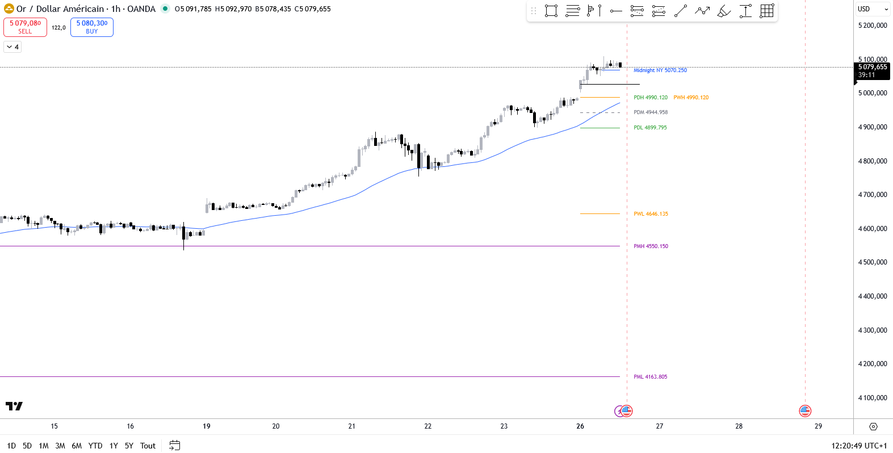

# Previous DWM + Midnight NY

Indicateur Pine Script v6 pour TradingView affichant les niveaux clés des périodes précédentes et l'open de minuit New York.

## Fonctionnalités

### Niveaux Previous Daily
- **High** et **Low** du jour précédent (vert par défaut)
- **Mid Range** (50% du range) avec paramètres de ligne séparés (gris, tirets par défaut)

### Niveaux Previous Weekly
- **High** et **Low** de la semaine précédente (orange par défaut)

### Niveaux Previous Monthly
- **High** et **Low** du mois précédent (violet par défaut)

### Midnight Open
- Open de la bougie à minuit (ou heure personnalisée) dans la timezone sélectionnée
- Timezone configurable (New York par défaut)
- Heure et minute configurables

### EMA
- Moyenne mobile exponentielle configurable
- Période par défaut : 50

## Paramètres

Chaque groupe de niveaux dispose de ses propres paramètres :
- **Show/Hide** - Activer/désactiver l'affichage
- **Couleurs** - Personnalisables pour High et Low
- **Épaisseur** - 1 à 5 pixels
- **Style** - Solid, Dashed (tirets), Dotted (pointillés)

### Paramètres Labels
- Affichage des prix à droite des lignes
- Taille configurable (Tiny, Small, Normal, Large)
- **Décalage dynamique** : les labels sont automatiquement décalés uniquement lorsque les prix sont proches
- **Proximity Threshold (%)** : seuil de proximité pour déclencher le décalage (défaut: 0.15%)
- **Label Offset (bars)** : nombre de barres de décalage appliqué (défaut: 12)

### Paramètres Midnight spécifiques
- **Timezone** : New York, Chicago, Los Angeles, London, Paris, Berlin, Tokyo, Hong Kong, Sydney, UTC
- **Heure** : 0-23
- **Minute** : 0-59

## Installation

1. Ouvrir TradingView
2. Accéder à l'Éditeur Pine (menu Produits en bas à droite)
3. Créer un nouveau script
4. Coller le contenu du fichier `Indicator_Previous_DWM_MidnightNY.pine`
5. Enregistrer et ajouter au graphique

## Utilisation

L'indicateur trace automatiquement les lignes horizontales depuis le début de chaque période jusqu'à la bougie en cours. Les niveaux sont mis à jour à chaque changement de période (nouveau jour, nouvelle semaine, nouveau mois).

## Auteur

© jcornier

## Licence

Ce code est soumis aux termes de la Mozilla Public License 2.0.
